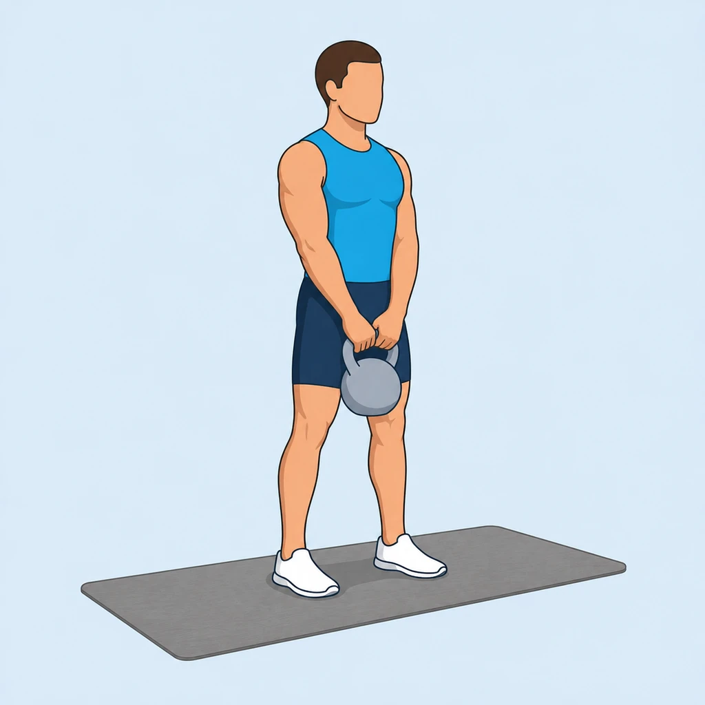
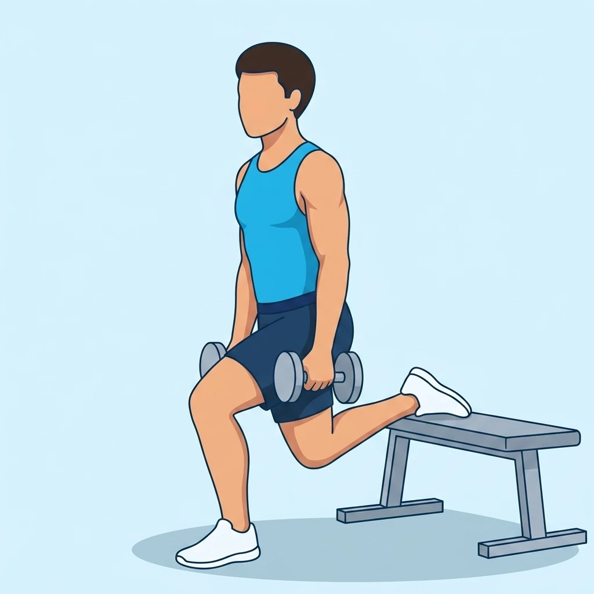

<div align="center">

# 💪 Exercise Dataset — Free JSON Sample (RepDB)

<p>
  
  
  
  
  
  
</p>

**A free, ready-to-use fitness exercise dataset in JSON — 21 exercises, each with two illustration styles (classic transparent + flat), start/peak poses, target muscles, equipment, MET values, and full multilingual instructions (English, German, Spanish).**

[-blue?style=flat-square)](exercises.json)
[](https://repdb.co)
[](images/)
[](#multilingual)
[](LICENSE-DATA.md)

**[🌐 Browse the exercises →](https://sergei-argutin.github.io/exercise-dataset/)** &nbsp;·&nbsp; **[⬇️ Get the full commercial dataset →](https://repdb.co)**

</div>

---

## What is this?

This is the **free preview** of [**RepDB**](https://repdb.co) — a curated, commercial-safe exercise dataset. It's a small, honest sample (21 hand-picked exercises) so you can inspect the data shape, the image quality, and the multilingual coverage before buying.

If you've used [`free-exercise-db`](https://github.com/yuhonas/free-exercise-db), the open ExerciseDB scrapes, or a public-domain workout JSON and wished it had **consistent illustrations, transparent-background images, German/Spanish translations, and a license you can actually ship commercially** — that's what the full RepDB bundle is. This repo lets you try a slice of it for free.

| | This free sample | [Full RepDB dataset](https://repdb.co) |
|---|---|---|
| Exercises | 21 | 350+ fully illustrated |
| Image styles | classic (transparent) + flat | both, every exercise |
| Poses | start + peak | start + peak (+ looping animations on higher tiers) |
| Languages | EN · DE · ES | EN · DE · ES |
| Muscles / equipment / MET | ✅ | ✅ |
| Alternatives & progressions | — | ✅ |
| Delivery | this repo (JSON + WebP) | JSON + SQLite + WebP, one download |
| License | CC BY-NC 4.0 (non-commercial) | **Commercial license included** |
| API / rate limits | none (it's just files) | none (it's just files) |

➡️ **For commercial use or the complete dataset, see [repdb.co](https://repdb.co).** One payment, no API, no rate limits, lifetime access + free updates.

## Quickstart

Everything is plain files — no API, no key, no rate limit.

```js
const data = await fetch(
  "https://raw.githubusercontent.com/sergei-argutin/exercise-dataset/main/exercises.json"
).then(r => r.json());

console.log(data.count);                       // 21
const ex = data.exercises[0];
console.log(ex.name_en, "·", ex.name_de);      // "Arnold Press · Arnold Press"
console.log(ex.images.classic.start);          // "images/classic/arnold-press-start.webp"
```

```python
import json, urllib.request
url = "https://raw.githubusercontent.com/sergei-argutin/exercise-dataset/main/exercises.json"
data = json.load(urllib.request.urlopen(url))
print(data["count"], "exercises")
for ex in data["exercises"]:
    print(ex["id"], "→", ex["body_part"], ex["equipment"])
```

## Schema

`exercises.json` is a single object: `{ name, homepage, license, schema_version, count, exercises[] }`.

Each entry in `exercises[]`:

| Field | Type | Notes |
|---|---|---|
| `id` | string | URL-safe slug, e.g. `bulgarian-split-squat` |
| `name_en` / `name_de` / `name_es` | string | Display name per locale |
| `description_en` / `_de` / `_es` | string | One-line summary |
| `instructions_en` / `_de` / `_es` | string[] | Step-by-step |
| `tips_en` / `_de` / `_es` | string[] | Form cues (where available) |
| `category` | string | `strength`, `stretching`, … |
| `force_type` | string | `push` / `pull` / `static` |
| `mechanic` | string | `compound` / `isolation` |
| `difficulty` | string | `beginner` / `intermediate` / `advanced` |
| `equipment` | string | e.g. `dumbbell`, `kettlebell`, `cable` |
| `body_part` | string | Primary region |
| `primary_muscles` / `secondary_muscles` | string[] | Anatomical slugs |
| `goals` | string[] | e.g. `hypertrophy`, `strength` |
| `tags` | string[] | e.g. `knee_safe`, `no_axial_load` |
| `met` | number | Metabolic equivalent (for calorie estimates) |
| `is_unilateral` / `is_bodyweight` | bool | |
| `images` | object | `{ classic: {start, peak}, flat: {start, peak} }` → repo-relative WebP paths |

### Images

84 WebP files (21 exercises × 2 styles × 2 poses), 512×512:

- `images/classic/` — 3D-render style on a **transparent** background (drop onto any UI).
- `images/flat/` — flat illustration on a solid designed background.
- Poses: `start` (setup) and `peak` (top of the movement).

The path is already in each record — `ex.images.classic.peak` → `images/classic/<id>-peak.webp`.

<a name="multilingual"></a>
### Multilingual

Names, descriptions, instructions, and tips ship in **English, German, and Spanish** for every exercise. The full dataset keeps the same EN/DE/ES coverage across all 350+ exercises.

## License

- **Data & images** — [CC BY-NC 4.0](LICENSE-DATA.md). Free for personal, research, and non-commercial use **with attribution**. Shipping in anything that earns money (paid app, paid feature, ad-supported product, client work) requires the commercial license → [repdb.co](https://repdb.co).
- **Code** (`index.html` viewer) — [MIT](LICENSE-CODE).

Attribution: *Exercise data & images: [RepDB](https://repdb.co).*

## Links

- 🌐 **Full dataset & pricing** — https://repdb.co
- 🧪 **Live browser for this sample** — https://sergei-argutin.github.io/exercise-dataset/
- 💬 **Questions** — support@repdb.co
