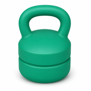
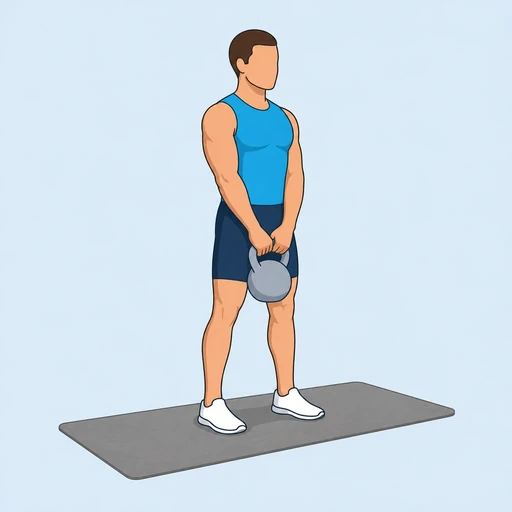
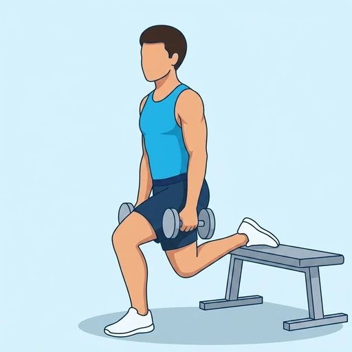

<div align="center">



# 💪 Free Exercise Dataset — JSON + Images (RepDB free tier)

<p>
  
  
  
  
  
  
</p>

**A free, ready-to-use multilingual fitness exercise dataset — 601 exercises in JSON with 512 px flat WebP illustrations, target muscles, equipment, MET values, and full instructions in English, German & Spanish. Free for personal *and* commercial in-app use, with attribution.**

[](exercises.json)
[](#multilingual)
[-success?style=flat-square)](LICENSE-DATA.md)
[](https://repdb.co/pricing?utm_source=github-dataset)

**[⬇️ Download the free ZIP →](https://cdn.repdb.co/repdb-assets/site/repdb-free.zip)** &nbsp;·&nbsp; **[🌐 Browse live →](https://exercise-dataset.com/)** &nbsp;·&nbsp; **[✨ Premium assets & license →](https://repdb.co/pricing?utm_source=github-dataset)**

</div>

---

## What is this?

This is the **free public edition** of [**RepDB**](https://repdb.co/?utm_source=github-dataset), a curated commercial exercise dataset. It contains **every fully illustrated exercise in the current catalog** (601 today): each exercise ships as JSON with flat-style 512 px WebP illustrations (start/peak poses, or a single pose for stretches), target muscles, equipment, goals, tags, MET values, and step-by-step instructions in **English, German, and Spanish**.

Unlike the usual scraped exercise JSONs, everything here is original, consistent, and **usable in commercial apps for free** — the only hard requirement is attribution. And unlike an API, it's just files: no key, no rate limit, no uptime to worry about.

> [!IMPORTANT]
> **Attribution is required.** Place a visible link — **"Exercise data by RepDB (repdb.co)"** — in your app's about/credits screen, your project's README, or your website footer. That's the price of the free tier.

Copy-paste Markdown, HTML, and app-credit versions are ready in
[`ATTRIBUTION.md`](ATTRIBUTION.md).

## License (summary)

Full text: [`LICENSE-DATA.md`](LICENSE-DATA.md). The seven terms in short:

1. **Free for personal and commercial use inside applications** — apps, websites, research projects, at no cost.
2. **Attribution required** — a visible "Exercise data by RepDB (repdb.co)" link.
3. **No redistribution as a dataset** — don't republish, resell, or repackage it (or a derivative) as a dataset, dataset repo, or API. In-app use only.
4. **Image modifications** — resize/crop/recolor for in-app use is fine; upscaled or background-removed derivatives still fall under the no-redistribution rule.
5. **No generative-AI derivation** — the images may not be used as input, reference, or training/conditioning material for generative models (image-to-image restyling, style transfer, fine-tuning, etc.); outputs count as derived datasets.
6. **`premium-samples/` is evaluation-only** — the paid-tier samples in that folder may not be used in production or redistributed.
7. **No warranty; not medical advice.**

This repository is RepDB's own canonical free-tier distribution — term 3 restricts third parties, not this publication (see the "About this repository" note in the license). The `index.html` viewer code is [MIT](LICENSE-CODE).

## Quickstart

```js
const data = await fetch(
  "https://exercise-dataset.com/exercises.json"
).then(r => r.json());

console.log(data.count, "exercises");
const ex = data.exercises[0];
console.log(ex.name_en, "·", ex.name_de, "·", ex.name_es);
console.log(ex.images.flat.start);   // "images/flat/<id>-start.webp"
```

```python
import json, urllib.request
url = "https://exercise-dataset.com/exercises.json"
data = json.load(urllib.request.urlopen(url))
print(data["count"], "exercises")
for ex in data["exercises"]:
    print(ex["id"], "→", ex["body_part"], ex["equipment"])
```

## Schema

`exercises.json` is a single object: `{ name, homepage, license, schema_version, count, note, exercises[] }`.

Each entry in `exercises[]`:

| Field | Type | Notes |
|---|---|---|
| `id` | string | URL-safe slug, e.g. `bulgarian-split-squat` |
| `name_en` / `name_de` / `name_es` | string | Display name per locale |
| `description_en` / `_de` / `_es` | string | One-line summary (where available) |
| `instructions_en` / `_de` / `_es` | string[] | Step-by-step |
| `tips_en` / `_de` / `_es` | string[] | Form cues (where available) |
| `category` | string | `strength`, `stretching`, … |
| `force_type` | string | `push` / `pull` / `static` / `dynamic` |
| `mechanic` | string | `compound` / `isolation` |
| `difficulty` | string | `beginner` / `intermediate` / `advanced` |
| `equipment` | string | e.g. `dumbbell`, `kettlebell`, `cable` — absent for bodyweight-only moves |
| `body_part` | string | Primary region |
| `primary_muscles` / `secondary_muscles` | string[] | Anatomical slugs |
| `goals` | string[] | e.g. `hypertrophy`, `strength` |
| `tags` | string[] | e.g. `knee_safe`, `no_axial_load` |
| `met` | number | Metabolic equivalent (for calorie estimates) |
| `is_unilateral` / `is_bodyweight` | bool | |
| `images` | object | `{ flat: {start, peak} }` **or** `{ flat: {main} }` → repo-relative WebP paths |

### Images

- `images/flat/` — flat-illustration style on a solid designed background, **512×512 WebP**.
- Most exercises have two poses, `start` and `peak`; stretches and holds have a single `main` pose. **Handle both shapes.**
- Some near-identical exercise variants intentionally share the same image file (aliases) — key your UI by exercise `id`, not by image path.
- The path is already in each record — `ex.images.flat.peak` → `images/flat/<id>-peak.webp`.

<a name="multilingual"></a>
### Multilingual

Names, descriptions, instructions, and tips ship in **English, German, and Spanish** for every exercise in the public catalog — the same exercise coverage as paid bundles.

## `premium-samples/` — paid-tier preview (evaluation only)

The [`premium-samples/`](premium-samples/) folder holds one **Standard-tier** showcase — classic stills plus a looping transparent-background animation, the same quality shown on [repdb.co](https://repdb.co/?utm_source=github-dataset) — so you can judge paid assets before buying. They are **evaluation-only**: not for production use, not for redistribution (license term 6). See it on the [live viewer](https://exercise-dataset.com/).

## Free vs. paid tiers

Every tier contains the same 601 distinct, fully illustrated movements. Paid
tiers add production-grade assets, richer developer data, and commercial use
without a RepDB attribution.

| | **Free** (this repo) | [**Starter**](https://repdb.co/pricing?utm_source=github-dataset) | [**Standard**](https://repdb.co/pricing?utm_source=github-dataset) |
|---|---|---|---|
| Exercise set | all 601 fully illustrated exercises | same 601-exercise catalog | same 601-exercise catalog |
| Still illustrations | flat style · solid background · 512×512 WebP | flat **+ classic** styles · 1024×1024 WebP | Starter **+ transparent classic backgrounds** |
| Classic art direction | — | designed classic style with target-muscle highlighting | same classic assets, ready for any theme |
| Animation | — | — | looping classic exercise animations with transparent backgrounds |
| Data & developer extras | JSON + WebP | JSON with activity metrics + relations graph | Starter **+ workout templates + AI embeddings** |
| Languages | EN · DE · ES | EN · DE · ES | EN · DE · ES |
| Commercial license | visible RepDB attribution required; in-app use | use under your own brand, no attribution | use under your own brand, no attribution |

➡️ **[repdb.co/pricing](https://repdb.co/pricing?utm_source=github-dataset)** — one payment, no subscription, no API, no rate limits.

## See it in real apps

Example integrations (each vendors this dataset):

- ▲ **Next.js** — https://github.com/RepDB/repdb-example-nextjs
- 📱 **React Native (Expo)** — https://github.com/RepDB/repdb-example-react-native
- 🐦 **Flutter** — https://github.com/RepDB/repdb-example-flutter

## Links

- ✨ **Premium assets & pricing** — [repdb.co](https://repdb.co/pricing?utm_source=github-dataset)
- 🧪 **Live browser for this dataset** — https://exercise-dataset.com/
- 📄 **One page per exercise** — muscles worked, equipment, instructions, tips and the raw JSON
  record, e.g. https://exercise-dataset.com/exercise/bulgarian-split-squat/
- 💬 **Questions** — support@repdb.co
